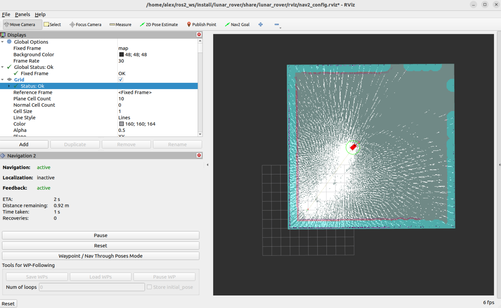
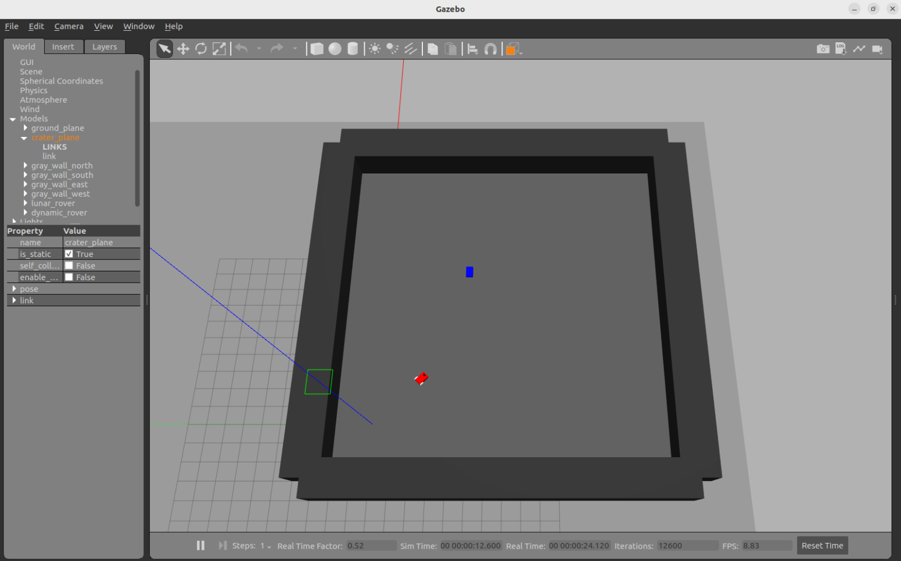
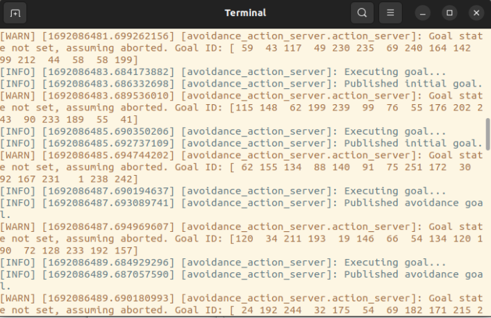
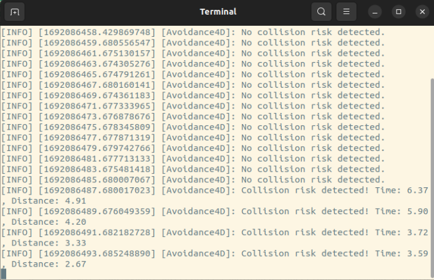
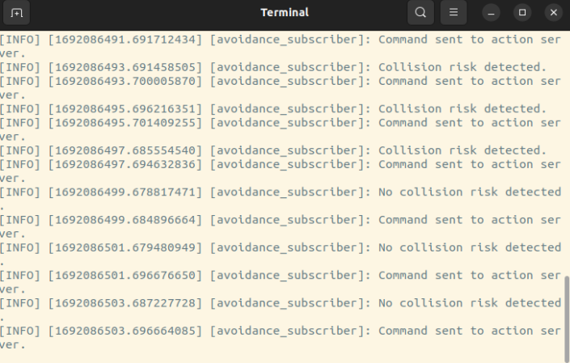
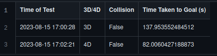

<a name="readme-top"></a>

<!-- PROJECT LOGO -->
<br />
<div align="center">
  <a href="https://github.com/github_username/repo_name">
    
  </a>

<h3 align="center">LunarLiDAR</h3>
  <p align="center">
    SLAM navigation system for lunar rovers aiming to evaluate the advantages of utilizing 4D LIDAR in contrast to conventional 3D LIDAR in the lunar environment. By fusing simulated 4D LIDAR with integrated sensors, this system aims to enhance collision detection, avoidance capabilities, and overall navigation efficiency.

`This project and its associated paper has been accepted to be presented at the International Astronautical Congress 2023 🚀`
    <br />
  </p>
</div>


<!-- TABLE OF CONTENTS -->
<details>
  <summary>Table of Contents</summary>
  <ol>
    <li>
      <a href="#about-the-project">About The Project</a>
      <ul>
        <li><a href="#built-with">Built With</a></li>
      </ul>
    </li>
    <li>
      <a href="#getting-started">Getting Started</a>
      <ul>
        <li><a href="#prerequisites">Prerequisites</a></li>
        <li><a href="#installation">Installation</a></li>
      </ul>
    </li>
    <li><a href="#usage">Usage</a></li>
    <li><a href="#results--findings">Results & Findings</a></li>
    <li><a href="#contact">Contact</a></li>
  </ol>
</details>


<!-- ABOUT THE PROJECT -->
## About The Project


<p>The recent advance of 4D LIDAR (Light Detection and Ranging) technology has opened up a new set of possibilities to explore space in much greater detail. This innovative technology is based on the principle of the Doppler effect, which enables it to compute instant velocity in real-time and hence adds a fourth dimension to its preceding technology. In 2022, AEVA, a company specialized in the production of autonomous driving sensors, developed the 4D LIDAR, a new tool that will revolutionize autonomous driving. This new generation of lidars offers better performance in terms of depth, instant velocity, reflectivity, and vision.</p>

<p>In recent times, the exploration of the lunar surface and utilization of lunar resources has become a dominant agenda of several government space agencies and private companies. Furthermore, with the rapid growth in the New Space sector, organizations would continue to highly invest in lunar exploration. With an apparent increase in rover missions in the near future, the ability of the rover system to identify other moving rovers and compute its velocity would become a critical design parameter.</p>

<p>The purpose of this project is to study the performance of the 4D LIDAR, combined with other onboard components using sensor fusion, and how it can help achieve better results when covering an undiscovered area with unknown environmental parameters.</p>

<p>The project plans to integrate the 4D LIDAR technology with different onboard sensors, evaluate its performance theoretically using software simulation, and present the final data illustrating the overall results. This would help demonstrate the higher performance parameters and precision levels that could be achieved for future rover missions.</p>

<p align="right">(<a href="#readme-top">back to top</a>)</p>


### Built With

* [![ROS 2][ROS2-shield]][ROS2-url]
* [![Python][Python-shield]][Python-url]
* [![C][C-shield]][C-url]
* [![Bash][Bash-shield]][Bash-url]

<p align="right">(<a href="#readme-top">back to top</a>)</p>


<!-- GETTING STARTED -->
## Getting Started

To get a local copy of LunarLiDAR up and running follow these simple steps.

### Prerequisites

* [ROS2 Iron Irwini](https://docs.ros.org/en/iron/Installation.html)
* [Gazebo Ignition Fortress](https://gazebosim.org/docs/fortress/install)
* Install nav2
  ```sh
   sudo apt install ros-iron-navigation2
   sudo apt install ros-iron-nav2-bringup
   ```

### Installation

1. Clone the repo
   ```sh
   gh repo clone alexmoica/LunarLiDAR_IAC
   ```
3. Create a [ROS2 workspace](https://docs.ros.org/en/iron/Tutorials/Beginner-Client-Libraries/Creating-A-Workspace/Creating-A-Workspace.html)
4. Place the `lunar_rover` folder in your ROS2 workspace
5. Open a terminal in your ROS2 workspace
6. Run `colcon build` to build the `lunar_rover` package

<p align="right">(<a href="#readme-top">back to top</a>)</p>


<!-- USAGE EXAMPLES -->
## Usage

To run the lunar rover simulation, follow these steps:
1. Open a new terminal in your ROS2 workspace and run `source install/setup.bash`
2. In the terminal, navigate to `/src/lunar_rover`
3. To run the 3D LiDAR simulation: `./start.sh 3d`
4. To run the 4D LiDAR simulation: `./start.sh 4d`

<br>
<div style="display: inline-block;">
  
  
  
</div>

Once the last command is executed, RViz and Gazebo will open, simulating the lunar rover. The rover employs SLAM to scan and navigate its environment, utilizing its onboard LiDAR.

<br>
<div style="display: inline-block;"></div>

For the avoidance system, an avoidance server is initiated first. This server accepts requests from an avoidance client regarding whether to provide an avoidance goal to the rover or not.

<br>
<div style="display: inline-block;"></div>

Next, a publishing server is launched, continuously broadcasting the locations of any rovers in the scene. If the `4d` option was selected, it will also publish their velocities.

<br>
<div style="display: inline-block;"></div>

A subscriber is initiated to listen to this server and calculate the collision risk between rovers. This is done by measuring the distance between the rovers (for `3d`) and considering the velocity vectors of both rovers (for `4d`). This subscriber also functions as the avoidance client, sending a request to the avoidance server to execute an avoidance maneuver when a collision risk is detected.

<br>
<br>


<br>3D LiDAR Test Case (6x speed)

<br>


<br>4D LiDAR Test Case (6x speed)

<br>
<div style="display: inline-block;"></div>

Just from this quick test case, we can already observe the potential performance and efficiency advantages of utilizing a 4D LiDAR.

<p align="right">(<a href="#readme-top">back to top</a>)</p>


<!-- RESULTS & FINDINGS -->
## Results & Findings

**UR = User Rover**
<br>
**OR = Obstacle Rover**

### Test 1: Increasing the speed of the OR

**Rationale**
<br>
To test the performance of the rover in a scenario with dynamic or unpredictable elements, requiring faster decision making.
<br>
<br>

**Initial Conditions**
<br>
`UR:` Begin at (0,0) and move towards the goal (9,-9) at a maximum speed of 0.36 units/s and with a maximum rotation speed of 1.0 rad/s
<br>
<br>
`OR Speed x1:` Begin at (12, -5) and patrol between (12, -5) and (4, -5) at a speed of 0.2667 units/s
<br>
<br>
`OR Speed x2:` Speed increased to 0.5333 units/s
<br>
<br>
`OR Speed x4:` Speed increased to 1.0667 units/s
<br>
<br>

**Results**

Average UR Speeds by Test Case

|  | OR Speed x1  | OR Speed x2 | OR Speed x3 |
| ------------- | ------------- | ------------- | ------------- |
| 3D  | 0.10 units/s  | 0.11 units/s  | 0.12 units/s  |
| 4D  | 0.19 units/s  | 0.20 units/s  | 0.18 units/s  |


Findings
<br>
The most important value for this test was the collision occurence as the OR's speed increased. We can see that at x4 Speed, the 3D LIDAR was unable to avoid a collision in a couple of the cases. In these cases, the UR was already intersecting the path of the OR when it detected the OR and because of the high speeds, the OR was unable to make large enough corrections in time. On the other hand, the 4D LIDAR was able to make more drastic corrections due to knowing how fast the OR was approaching. There is no meaningful change in the amount of time to the goal, any variation can be attributed to where the obstacle rover was on its path when it was intersected by the user rover.


Test 2: Increasing the speed of the user rover

Rationale
<br>
To test the ability of the rover to handle high-speed navigation and obstacle avoidance.

Initial Conditions
<br>
`OR:` Begin at (12, -5) and patrol between (12, -5) and (4, -5) at a speed of 0.2667 units/s
<br>
`UR Speed x1:` Begin at (0,0) and move towards the goal (9,-9) at a maximum speed of 0.36 units/s and with a maximum rotation speed of 1.0 rad/s
<br>
`UR Speed x2:` Maximum speed increased to 0.72 units/s and 2.0 rad/s
<br>
`UR Speed x4:` Maximum speed increased to 1.44 units/s and 4.0 rad/s

Results


Average UR Speeds
UR Speed x1:
3D: 0.10 units/s
4D: 0.19 units/s

UR Speed x2:
3D: 0.15 units/s
4D: 0.24 units/s

UR Speed x4:
3D: 0.21 units/s
4D: 0.32 units/s


Findings
<br>
Both 3D and 4D LIDARS were able to successfully navigate to the goal in high speed environments without collisions occuring. The 4D LIDAR resulted in a consistently faster path to the goal, with the average speed increasing by 23.89% from Speed x1 to Speed x2 and 32.62% from Speed x2 to Speed x4. Although slower overall, the 3D LIDAR average speed increased at a greater rate between series, with a 53.53% and 33.19% increase respectively. 3D LIDAR scales more because the algorithm keeps a constant distance from the OR when avoiding it, meaning that the same amount of extra distance towards the goal has to be covered and so a faster speed will save time in this segment. Since the 4D LIDAR pathing doesent experience as large increase rates, it also means that it is a more effecient algorithm overall than the 3D one.


Test 3: Placing an obstacle between the rovers

Rationale
<br>
To test the rover's ability to respond to both stationary and moving obstacles, particularly in scenarios where it has minimal time to detect the moving obstacle.

Initial Conditions
<br>
`OR:` Begin at (12, -5) and patrol between (12, -5) and (4, -5) at a speed of 0.2667 units/s
<br>
`UR` Begin at (0,0) and move towards the goal (9,-9) at a maximum speed of 0.36 units/s and with a maximum rotation speed of 1.0 rad/s
<br>
`Static Obstacle` Wall measuring 4 units in the x-direction and 0.5 units in the y-direction, centered at (3, -3)

Reference Photos


Results

Average UR Speeds
No Obstacle:
3D: 0.10 units/s
4D: 0.19 units/s

With Obstacle:
3D: 0.07 units/s
4D: 0.18 units/s


Findings
<br>
Both LIDARS were able to navigate to the goal without collisions when a static obstacle was introduced. The 4D LIDAR did not suffer a meaningful decrease in average speed, taking extra time to navigate around the wall but still plotting an effecient path around the OR, while the 3D LIDAR experienced an additional pathing delay between navigating around the wall and avoiding the OR.


<p align="right">(<a href="#readme-top">back to top</a>)</p>


<!-- CONTACT -->
## Contact

Alex Moica - <a href="https://www.linkedin.com/in/alexmoica/" target="_blank">LinkedIn</a> - alex@alexmoica.com

<p align="right">(<a href="#readme-top">back to top</a>)</p>


<!-- MARKDOWN LINKS & IMAGES -->
[ROS2-shield]: https://img.shields.io/badge/ROS2-20232A?style=for-the-badge&logo=ros
[ROS2-url]: https://docs.ros.org/en/iron/index.html
[Python-shield]: https://img.shields.io/badge/Python-20232A?style=for-the-badge&logo=python
[Python-url]: https://www.python.org/
[C-shield]: https://img.shields.io/badge/C-20232A?style=for-the-badge&logo=C
[C-url]: https://devdocs.io/c/
[Bash-shield]: https://img.shields.io/badge/Bash-20232A?style=for-the-badge&logo=gnubash
[Bash-url]: https://www.gnu.org/software/bash/
