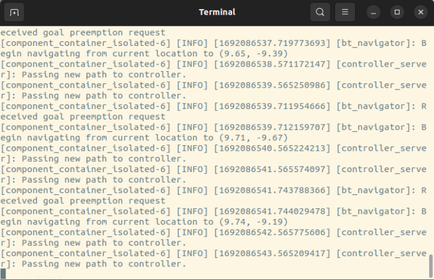

<a name="readme-top"></a>

<!-- PROJECT LOGO -->
<br />
<div align="center">
  <a href="https://github.com/github_username/repo_name">
    
  </a>

<h3 align="center">LunarLiDAR</h3>
  <p align="center">
    SLAM navigation system for lunar rovers aiming to evaluate the advantages of utilizing 4D LIDAR in contrast to conventional 3D LIDAR in the lunar environment. By fusing simulated 4D LIDAR with integrated sensors, this system aims to enhance collision detection, avoidance capabilities, and overall navigation efficiency.
    <br />
  </p>
</div>


<!-- TABLE OF CONTENTS -->
<details>
  <summary>Table of Contents</summary>
  <ol>
    <li>
      <a href="#about-the-project">About The Project</a>
      <ul>
        <li><a href="#built-with">Built With</a></li>
      </ul>
    </li>
    <li>
      <a href="#getting-started">Getting Started</a>
      <ul>
        <li><a href="#prerequisites">Prerequisites</a></li>
        <li><a href="#installation">Installation</a></li>
      </ul>
    </li>
    <li><a href="#usage">Usage</a></li>
    <li><a href="#results-&-findings">Results & Findings</a></li>
    <li><a href="#contact">Contact</a></li>
  </ol>
</details>


<!-- ABOUT THE PROJECT -->
## About The Project


<p>The recent advance of 4D LIDAR (Light Detection and Ranging) technology has opened up a new set of possibilities to explore space in much greater detail. This innovative technology is based on the principle of the Doppler effect, which enables it to compute instant velocity in real-time and hence adds a fourth dimension to its preceding technology. In 2022, AEVA, a company specialized in the production of autonomous driving sensors, developed the 4D LIDAR, a new tool that will revolutionize autonomous driving. This new generation of lidars offers better performance in terms of depth, instant velocity, reflectivity, and vision.</p>

<p>In recent times, the exploration of the lunar surface and utilization of lunar resources has become a dominant agenda of several government space agencies and private companies. Furthermore, with the rapid growth in the New Space sector, organizations would continue to highly invest in lunar exploration. With an apparent increase in rover missions in the near future, the ability of the rover system to identify other moving rovers and compute its velocity would become a critical design parameter.</p>

<p>The purpose of this project is to study the performance of the 4D LIDAR, combined with other onboard components using sensor fusion, and how it can help achieve better results when covering an undiscovered area with unknown environmental parameters.</p>

<p>The project plans to integrate the 4D LIDAR technology with different onboard sensors, evaluate its performance theoretically using software simulation, and present the final data illustrating the overall results. This would help demonstrate the higher performance parameters and precision levels that could be achieved for future rover missions.</p>

<p align="right">(<a href="#readme-top">back to top</a>)</p>


### Built With

* [![ROS 2][ROS2-shield]][ROS2-url]
* [![Python][Python-shield]][Python-url]
* [![C][C-shield]][C-url]
* [![Bash][Bash-shield]][Bash-url]

<p align="right">(<a href="#readme-top">back to top</a>)</p>


<!-- GETTING STARTED -->
## Getting Started

This is an example of how you may give instructions on setting up your project locally.
To get a local copy up and running follow these simple example steps.

### Prerequisites

This is an example of how to list things you need to use the software and how to install them.
* npm
  ```sh
  npm install npm@latest -g
  ```

### Installation

1. Get a free API Key at [https://example.com](https://example.com)
2. Clone the repo
   ```sh
   git clone https://github.com/github_username/repo_name.git
   ```
3. Install NPM packages
   ```sh
   npm install
   ```
4. Enter your API in `config.js`
   ```js
   const API_KEY = 'ENTER YOUR API';
   ```

<p align="right">(<a href="#readme-top">back to top</a>)</p>


<!-- USAGE EXAMPLES -->
## Usage

To run the lunar rover simulation, follow these steps:
1. Open a terminal in your ROS2 workspace
2. Make sure to place the `lunar_rover` folder in your ROS2 workspace
3. Run `colcon build` to build the lunar_rover package
4. Open a new terminal in your ROS2 workspace and run `source install/setup.bash`
5. In the terminal, navigate to `/src/lunar_rover`
6. To run the 3D LiDAR simulation: `./start.sh 3d`
7. To run the 4D LiDAR simulation: `./start.sh 4d`

<br>
<div style="display: inline-block;">
  
  
  
</div>

Once the last command is executed, RViz and Gazebo will open, simulating the lunar rover. The rover employs SLAM to scan and navigate its environment, utilizing its onboard LiDAR.

<br>
<div style="display: inline-block;"></div>

For the avoidance system, an avoidance server is initiated first. This server accepts requests from an avoidance client regarding whether to provide an avoidance goal to the rover or not.

<br>
<div style="display: inline-block;"></div>

Next, a publishing server is launched, continuously broadcasting the locations of any rovers in the scene. If the `4d` option was selected, it will also publish their velocities.

<br>
<div style="display: inline-block;"></div>

A subscriber is initiated to listen to this server and calculate the collision risk between rovers. This is done by measuring the distance between the rovers (for `3d`) and considering the velocity vectors of both rovers (for `4d`). This subscriber also functions as the avoidance client, sending a request to the avoidance server to execute an avoidance maneuver when a collision risk is detected.

<br>
<br>

<div style="display: inline-block;"></div>

3D LiDAR Test Case (6x speed)

<br>

<div style="display: inline-block;"></div>

4D LiDAR Test Case (6x speed)

<br>
<div style="display: inline-block;"></div>

Just from this quick test case, we can already observe the potential performance and efficiency advantages of utilizing a 4D LiDAR.

<p align="right">(<a href="#readme-top">back to top</a>)</p>


<!-- RESULTS & FINDINGS -->
## Results & Findings

<p align="right">(<a href="#readme-top">back to top</a>)</p>


<!-- CONTACT -->
## Contact

Alex Moica - <a href="https://www.linkedin.com/in/alexmoica/" target="_blank">LinkedIn</a> - alex@alexmoica.com

<p align="right">(<a href="#readme-top">back to top</a>)</p>


<!-- MARKDOWN LINKS & IMAGES -->
[ROS2-shield]: https://img.shields.io/badge/ROS2-20232A?style=for-the-badge&logo=ros
[ROS2-url]: https://docs.ros.org/en/iron/index.html
[Python-shield]: https://img.shields.io/badge/Python-20232A?style=for-the-badge&logo=python
[Python-url]: https://www.python.org/
[C-shield]: https://img.shields.io/badge/C-20232A?style=for-the-badge&logo=C
[C-url]: https://devdocs.io/c/
[Bash-shield]: https://img.shields.io/badge/Bash-20232A?style=for-the-badge&logo=gnubash
[Bash-url]: https://www.gnu.org/software/bash/
